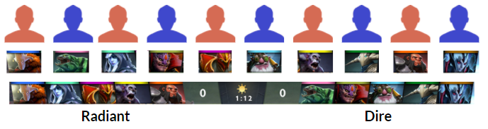
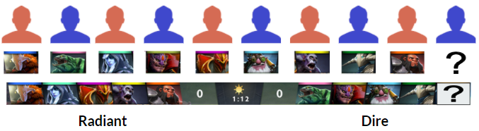

# Problem Statement

Every game of DOTA 2 is started by picking heros. 5 people on one team and 5 people on the other team must each pick unique hero from a roster of 119 choices. These heroes all have unique special abilities and perform better or worse against different oppoent heroes. As there are strengths and weaknesses in hero matchups, we can leverage this information to predict which team of 5 will win based solely on which heroes were picked.

The goal was to create an algorithm to predict which team of 5 heroes has the best chance of winning. Additionally, if one hero is missing provide 5 options that would provide the best chance of winning.

# Dataset

The data analyzed was collected using d2api Python wrapper for the Steam Web API. Over the course of 2 weeks 100,000 matches were collected. Each match had the winner, duration, and the player heroes recorded. The data dictionary is shown below.

# Executive Summary

A CountVectorizer was used to turn each team of 5 heroes into a 119 features, for a total of 238 features for each match. These matches were then used to train a feedforward neural network to predict which team will win. This trained model was then used to recommend heroes if a complete set of 10 heroes was not input. The model is 62% accurate on the training data and 60% for the testing data. This is an increase of 3 percent over the baseline.

Below is an image showing a typical draft of heroes for all 10 players.

The neural network predicts that Radiant has a **65%** chance of winning.

If instead the final person wanted to pick which ever hero game them the best chance of winning, the neural network can be used to predict win probabilities for all unselected heroes in a Dota 2 game. The image below shows what an incomplete Dota 2 draft might look like.

Based on the above draft, the model recommends the hero Abyssal Underlord, which increases the win probability from 35% for dire (when Vengeful Spirit is picked) to 43%, an increase of **8%** just by picking a different hero.

# Conclusions

* A neural network was created and trained on 100,000 Dota 2 matches to try and predict winning hero combinations
* The model correctly predicts the winner team around 60% of time, an increase of 3% over the baseline
* The model overpredicts the Radiant team winning which is expected as Radiant wins 55% of the time

## Next Steps

* Look into collect additional Dota 2 match data. 100,000 matches just isn't enough to get a great idea behind which heroes are better or worse against others
* Determine if additional draft parameters such as when a hero was picked or what the bans were in the game provide useful information to make the model more powerful  

# Data Dictionary

|
Feature|
Type|
Description|
| --- | --- | --- |
|
Match ID|
Discrete|
The Dota 2 match id number which can be used to lookup additional information about a specific game|
|
Start Time|
Discrete|
The UTC integer for when the match started|
|
Game Mode|
Discrete|
Describes what type of game of Dota 2 was played|
|
Lobby Type|
Discrete|
Describes if the match was ranked or casual matchmaking|
|
Duration|
Discrete|
The length of the Dota 2 match in seconds|
|
Winner|
String|
Records which team won the match, either Radiant or Dire|
|
Player Hero|
String|
Describes which of the 119 unique heroes was chosen by each player for all 5 player on Radiant and Dire|